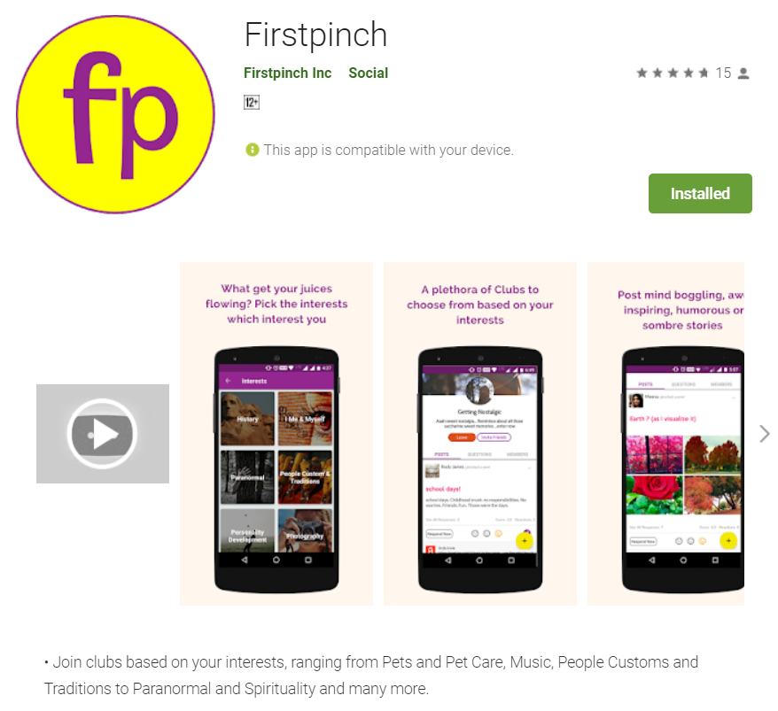
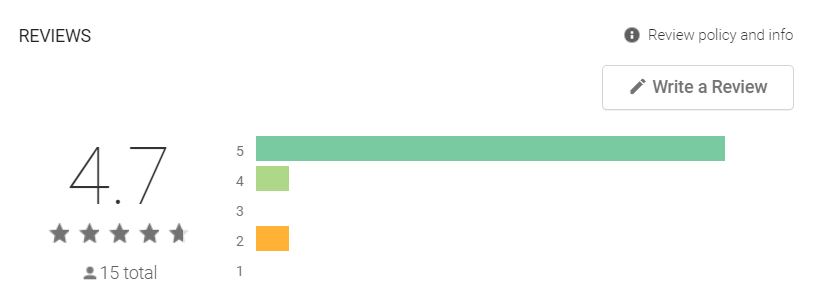
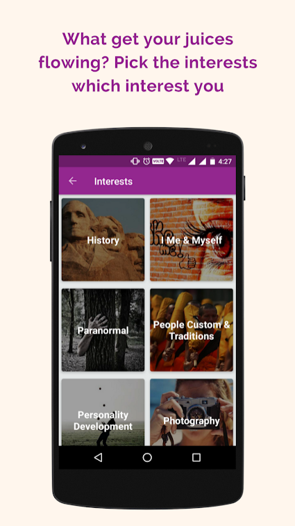
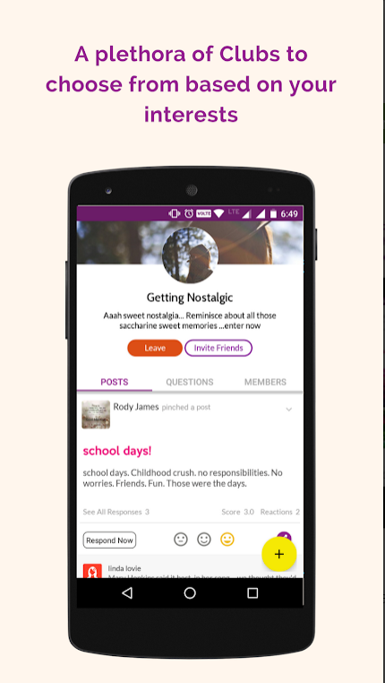
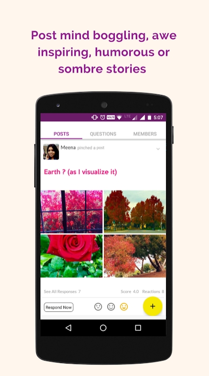
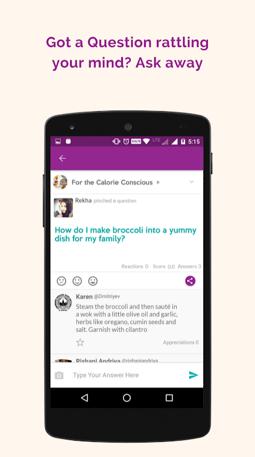
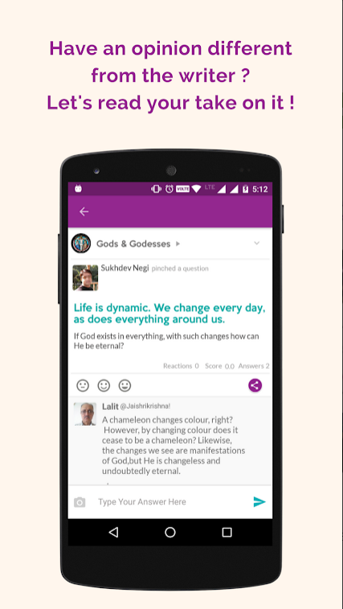
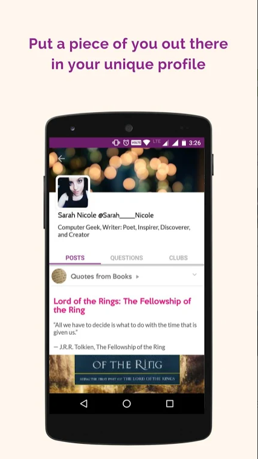

# FirstPinch
Join clubs based on your interests, ranging from Pets and Pet Care, Music, People Customs and Traditions to Paranormal and Spirituality and many more.

Below are the screenshots from Google Play Store,

# Introduction from Playstore Description

• Join clubs based on your interests, ranging from Pets and Pet Care, Music, People Customs and Traditions to Paranormal and Spirituality and many more.

• Post stories, videos and more in the various clubs

• Ask questions/ give answers

• Share all that you love with like- minded people worldwide

• Join in on all the fun and excitement, become a Firstpincher today!!

# Features implemented

- Developed Social Media application from scratch following android material design.
- Implemented all social media functionalities using RESTful APIs mentioned in points below and launched the application within 6 months.
- Worked on SQL for offline working and analytics using SQLite.

Below are the detailed social media features developed in the application from scratch,
1.	Simple user interface
2.	Search implemented for profiles, posts, comments data
3.	Personalized user profile
4.	Notifications and real time updates
5.	Infinite scrollable news feed
6.	The ability to attach different files and camera photographs
7.	Commenting and liking
8.	The ability to upload content
9.	The ability to create groups and communities
10.	The ability to edit the user profile
11.	Sharing capabilities connected to other social channels
12.	Emojis and stickers
13.	The ability to send invites
14.	The ability to add or remove friends/connections
15.	The ability to tag users in comments section
16.	Offline working new feed and user profile
17.	The ability to bookmark user/group posts.

Below are more screenshots from Google Play Store,

